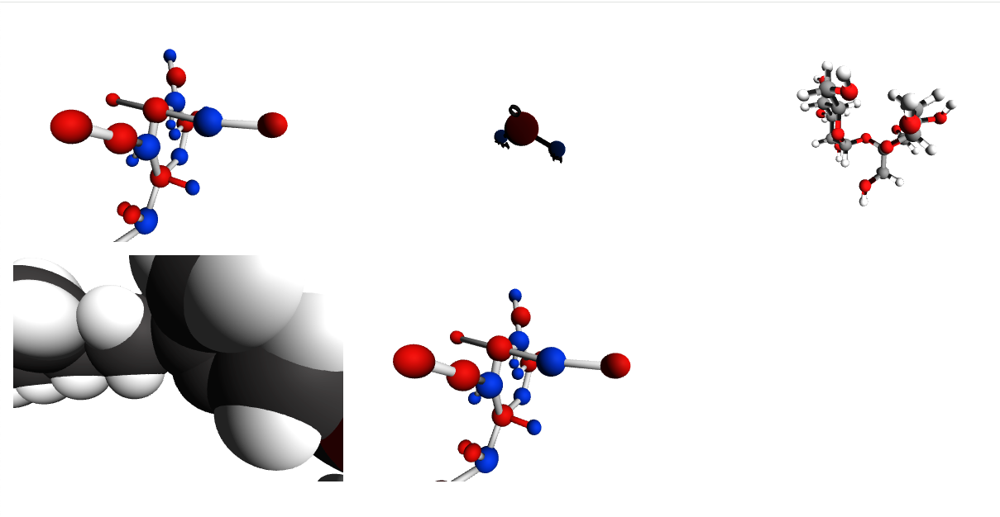

# Molecules demo
Basic NodeJS code example.

### Next steps (future)
Create a single page application using React to consume the backend APIs. 
So far, I've just created it locally to consume the APIs, but an SPA is more powerful.

### Install dependencies
```shell
npm install
```

### Build the code
```shell
npm run build
```

### Run the code
```shell
npm run start
```

# Molecule API

This module defines the API routes for interacting with molecules and their 3D models.

## Endpoints

### `POST /molecules/`

Creates a new molecule.

#### Response Example
```json
{
  "id": "1",
  "name": "Water",
  "model": "H2O.glb"
}
```

### `GET /molecules/`

Returns a list of all molecules.

#### Response Example
```json
[
  {
    "id": "1",
    "name": "Water",
    "model": "H2O.glb"
  },
  {
    "id": "2",
    "name": "Methane",
    "model": "CH4.glb"
  }
]
```

---

### `GET /molecules/:id`

Returns detailed information about a specific molecule by its ID.

#### Response Example
```json
{
  "id": "1",
  "name": "Water",
  "model": "H2O.glb"
}
```

#### Error Responses
- `404 Not Found` – if the molecule does not exist

---

### `GET /molecules/:id/model`

Returns the 3D model file (e.g., `.obj`, `.glb`, etc.) associated with the molecule, if available. This is typically used for rendering molecular structures in 3D applications.

#### Response
- A downloadable 3D model file

#### Error Responses
- `404 Not Found` – if the molecule or model file is not available

---

## Usage Examples

### Creates a new molecule with `curl`
```bash
curl -X POST http://localhost:3000/api/molecules \
  -H "Content-Type: application/json" \
  -d '{
    "name": "Water",
    "model": "sucrose_molecule.glb"
  }'
```

### Fetch all molecules with `curl`
```bash
curl http://localhost:3000/molecules/
```

### Fetch a specific molecule
```bash
curl http://localhost:3000/molecules/1
```

### Download a 3D model
```bash
curl -O http://localhost:3000/molecules/1/model
```

---

## Database setup
Using [Prima with SQLite](https://www.prisma.io/docs/getting-started/quickstart-sqlite) for demo purpose

```bash
 dotenv -e src/.env.dev  npx prisma migrate dev --name init
```

## Purpose

This API provides access to molecular data and 3D models, supporting applications such as:

- Molecular visualization tools
- Educational platforms for chemistry
- Scientific research utilities

---

## Code Structure

- Routes are defined using `Express.js`
- Route handlers are implemented in `molecule.controller.ts`

---

## 3D page using Three.js library - Just to render the 3D models from the API 


